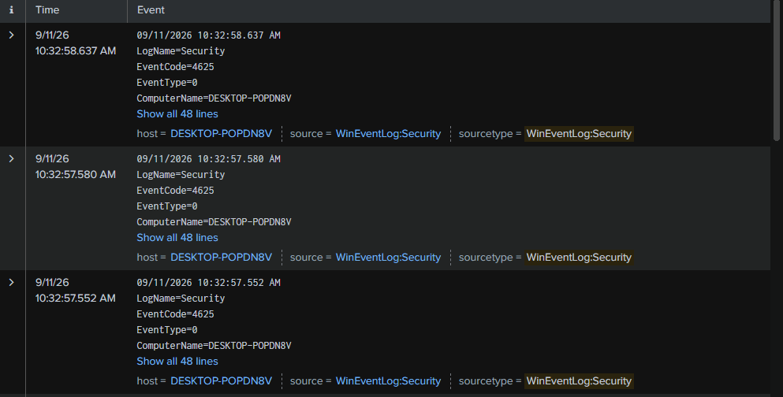

# Phát hiện tấn công Brute-force nhắm vào tài khoản Admin qua RDP

## 1. Tóm tắt (Executive Summary)

Vào ngày 11/09/2026, hệ thống SIEM (Splunk) ghi nhận 10 lần đăng nhập 
thất bại liên tiếp nhắm vào tài khoản `admin` trên máy `DESKTOP-POPDN8V`, 
xuất phát từ địa chỉ IP `192.168.52.128` (máy Kali Linux trong lab). 
Các lần thử được thực hiện bằng công cụ Hydra, mô phỏng kỹ thuật 
brute-force qua giao thức RDP.

## 2. Timeline

| Thời gian | Sự kiện |
|---|---|
| 10:28:50 - 10:29:00 AM | Cụm 1: 7 lần đăng nhập thất bại liên tiếp |
| 10:32:50 | Cụm 2: 3 lần đăng nhập thất bại |

## 3. Indicators of Compromise (IOC)

| Loại | Giá trị |
|---|---|
| Source IP | 192.168.52.128 |
| Source Hostname | kali |
| Target Account | admin |
| Target Host | DESKTOP-POPDN8V |
| Logon Type | 3 (Network) |
| Event ID | 4625 |

## 4. MITRE ATT&CK Mapping

- **Tactic:** Credential Access
- **Technique:** T1110 - Brute Force
- **Sub-technique:** T1110.001 - Password Guessing

## 5. Phương pháp phát hiện (Detection Method)

Sử dụng Splunk để tìm các tài khoản có nhiều lần đăng nhập thất bại 
từ cùng một địa chỉ IP trong thời gian ngắn:

```spl
index=main sourcetype="WinEventLog:Security" EventCode=4625 Account_Name!="-"
| stats count by Account_Name, Source_Network_Address 
| where count > 5
```

Bổ sung: biểu đồ theo thời gian để xác nhận pattern dồn dập đặc trưng 
của brute-force (khác với việc người dùng gõ nhầm mật khẩu rải rác):

```spl
index=main sourcetype="WinEventLog:Security" EventCode=4625 Account_Name="admin"
| timechart span=10s count
```

## 6. Bằng chứng (Evidence)

**Biểu đồ số lần đăng nhập thất bại theo thời gian:**


**Chi tiết một sự kiện Event ID 4625:**



## 7. Đánh giá mức độ nghiêm trọng (Severity)

**Mức độ: Trung bình (Medium)**

Tấn công brute-force chưa thành công (RDP từ chối do tài khoản `admin` 
chưa được cấp quyền Remote Desktop), nhưng cho thấy có hoạt động dò 
mật khẩu chủ động nhắm vào tài khoản quản trị — cần theo dõi và ngăn 
chặn sớm để tránh rủi ro leo thang nếu kẻ tấn công đổi mục tiêu hoặc 
tài khoản bị cấp quyền remote trong tương lai.

## 8. Khuyến nghị xử lý (Recommendations)

1. Chặn địa chỉ IP `192.168.52.128` tại firewall.
2. Bật **Account Lockout Policy** — khóa tài khoản sau 5 lần đăng nhập sai.
3. Bật **MFA (xác thực đa yếu tố)** cho các tài khoản có quyền remote access.
4. Giới hạn RDP chỉ cho phép kết nối từ các IP nội bộ tin cậy (whitelist).
5. Theo dõi thêm Event ID `4624` (đăng nhập thành công) từ cùng IP để 
   xác nhận tấn công có thành công ở lần thử sau hay không.

---
*Report được thực hiện trong môi trường lab cá nhân nhằm mục đích luyện tập kỹ năng SOC Tier 1.*
