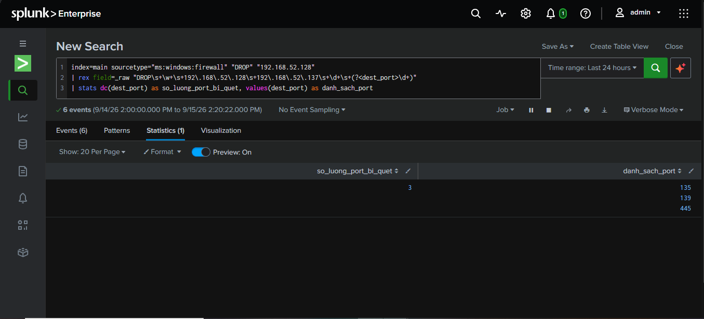
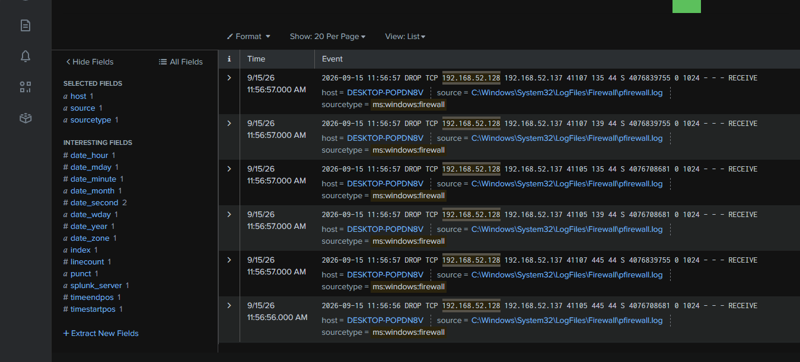

# Phát hiện Port Scan (Network Reconnaissance) từ Kali Linux

## 1. Tóm tắt (Executive Summary)

Vào ngày 15/09/2026, hệ thống ghi nhận hoạt động quét cổng (port scan) 
nhắm vào máy `DESKTOP-POPDN8V` (192.168.52.137), xuất phát từ địa chỉ 
IP `192.168.52.128` (máy Kali Linux trong lab). Công cụ Nmap được sử 
dụng để dò 3 cổng dịch vụ (135, 139, 445) trong khoảng thời gian chưa 
đầy 1 giây, ghi nhận qua Windows Firewall Log.

## 2. Timeline

| Thời gian | Sự kiện |
|---|---|
| 11:56:56 - 11:56:57 AM | 6 gói tin SYN bị DROP, nhắm tới port 135, 139, 445 (mỗi port 2 lượt probe) |

## 3. Indicators of Compromise (IOC)

| Loại | Giá trị |
|---|---|
| Source IP | 192.168.52.128 |
| Target IP | 192.168.52.137 |
| Target Host | DESKTOP-POPDN8V |
| Ports Scanned | 135 (msrpc), 139 (netbios-ssn), 445 (microsoft-ds) |
| Packet Flag | S (SYN) |
| Firewall Action | DROP |

## 4. MITRE ATT&CK Mapping

- **Tactic:** Discovery
- **Technique:** T1046 - Network Service Discovery

## 5. Phương pháp phát hiện (Detection Method)

Sử dụng Windows Firewall Log (không dùng Sysmon vì bị filter mất nhiều 
sự kiện kết nối mạng). Query đếm số cổng khác nhau mà một IP nguồn 
từng bị DROP kết nối tới trong thời gian ngắn — dấu hiệu đặc trưng 
của port scan:

```spl
index=main sourcetype="ms:windows:firewall" "DROP" "192.168.52.128"
| rex field=_raw "DROP\s+\w+\s+192\.168\.52\.128\s+192\.168\.52\.137\s+\d+\s+(?<dest_port>\d+)"
| stats dc(dest_port) as so_luong_port_bi_quet, values(dest_port) as danh_sach_port
```

Kết quả: `so_luong_port_bi_quet = 3`, `danh_sach_port = 135, 139, 445`.

## 6. Bằng chứng (Evidence)

**Kết quả query thống kê số cổng bị quét:**



**Chi tiết raw log DROP events:**



## 7. Đánh giá mức độ nghiêm trọng (Severity)

**Mức độ: Thấp - Trung bình (Low - Medium)**

Bản thân port scan không gây thiệt hại trực tiếp, nhưng là dấu hiệu 
**trinh sát (reconnaissance)** — bước đầu tiên kẻ tấn công thường thực 
hiện để xác định dịch vụ đang chạy trước khi lên kế hoạch tấn công sâu 
hơn (ví dụ: khai thác lỗ hổng SMB qua port 445, hoặc brute-force RDP 
như case trước). Cần theo dõi vì có thể là tiền đề cho một cuộc tấn 
công lớn hơn.

## 8. Khuyến nghị xử lý (Recommendations)

1. Chặn địa chỉ IP `192.168.52.128` tại firewall nếu không phải nguồn 
   tin cậy.
2. Đóng các cổng không cần thiết (135, 139 - NetBIOS legacy) nếu không 
   sử dụng.
3. Bật cảnh báo (alert) tự động khi phát hiện 1 IP quét từ 3 cổng 
   khác nhau trở lên trong vòng dưới 5 giây.
4. Theo dõi các sự kiện tiếp theo từ cùng IP nguồn (đặc biệt Event ID 
   4625 - login failed) để xác định IP có tiếp tục leo thang tấn công 
   hay không, liên hệ case [Brute-force RDP Detection](brute-force-rdp-detection.md).
5. Xem xét triển khai IDS/IPS (vd: Snort, Suricata) để phát hiện port 
   scan real-time thay vì chỉ dựa vào firewall log.

---
*Report được thực hiện trong môi trường lab cá nhân nhằm mục đích luyện tập kỹ năng SOC Tier 1.*
